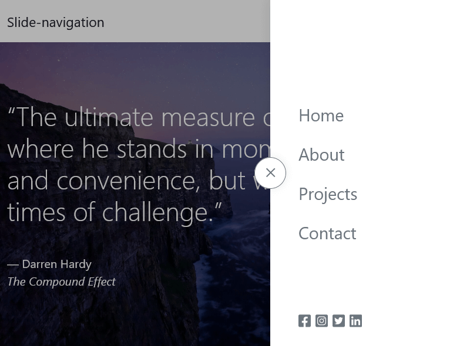

# Slide-navigation

Slide-navigation, Responsive and animated slide navigation.

## Table of contents

- [Overview](#overview)
  - [Screenshot](#screenshot)
  - [Links](#links)
- [My process](#my-process)
  - [Built with](#built-with)
- [Getting started](#getting-started)
  - [Development dependencies](#development-dependencies)
  - [Installing](#installing)
    - [Edit or development](#edit-or-development)
- [Author](#author)

## Overview

### Screenshot

### Links

- Live Site URL: [live Site](https://james-alderson.github.io/JavaScript-Projects/Projects/05-Slide-navigation/index.html)

## My process

### Built with

- Semantic HTML5 markup
- Flexbox
- Mobile-first workflow
- [gulp](https://gulpjs.com/) - Task runner
- [Bootstrap](https://getbootstrap.com/) - CSS framework

## Getting Started

### Development dependencies

- [autoprefixer](https://www.npmjs.com/package/autoprefixer) ^10.4.12
- [browser-sync](https://www.npmjs.com/package/browser-sync) ^2.27.10
- [cssnano](https://www.npmjs.com/package/cssnano) ^5.1.13
- [gulp](https://www.npmjs.com/package/gulp) ^4.0.2
- [gulp-concat](https://www.npmjs.com/package/gulp-concat) ^2.6.1
- [gulp-postcss](https://www.npmjs.com/package/gulp-postcss) ^9.0.1
- [gulp-replace](https://www.npmjs.com/package/gulp-replace) ^1.1.3
- [gulp-terser](https://www.npmjs.com/package/gulp-terser) ^2.1.0
- [postcss](https://www.npmjs.com/package/postcss) ^8.4.17

### Installing

#### Edit or Development

- Install [Node.js](https://nodejs.org/en/).
- Run `npm install`.
- Run `gulp`.
- Make any changes or development in the 'src' directory, Then run `gulp` to apply the final changes.
- You can create a localhost by running `gulp bs` to see the changes in momentary.

## Author

- Email - [james.alderson.a@gmail.com](mailto:james.alderson.a@gmail.com)
