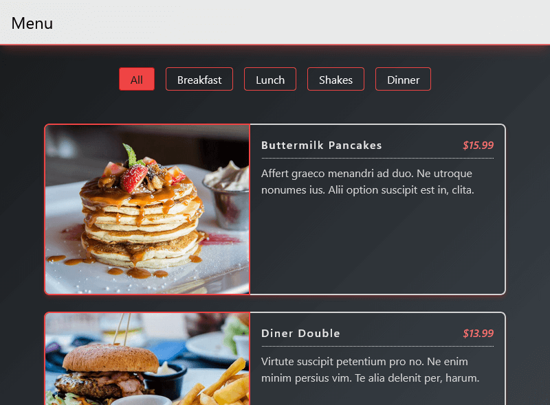

# Menu

Menu, Responsive and animated restaurant menu.

## Table of contents

- [Overview](#overview)
  - [Screenshot](#screenshot)
  - [Links](#links)
- [My process](#my-process)
  - [Built with](#built-with)
- [Getting started](#getting-started)
  - [Development dependencies](#development-dependencies)
  - [Installing](#installing)
    - [Edit or development](#edit-or-development)
      - [Work by Tailwind](#work-by-tailwind)
      - [Work by Gulp](#work-by-gulp)
- [Author](#author)

## Overview

### Screenshot

### Links

- Live Site URL: [live Site](https://james-alderson.github.io/JavaScript-Projects/Projects/08-Menu/index.html)

## My process

### Built with

- Semantic HTML5 markup
- Flexbox
- CSS Grid
- Mobile-first workflow
- [gulp](https://gulpjs.com/) - Task runner
- [Tailwind](https://tailwindcss.com/) - CSS framework

## Getting Started

### Development dependencies

- [browser-sync](https://www.npmjs.com/package/browser-sync) ^2.27.10
- [gulp](https://www.npmjs.com/package/gulp) ^4.0.2
- [gulp-concat](https://www.npmjs.com/package/gulp-concat) ^2.6.1
- [gulp-replace](https://www.npmjs.com/package/gulp-replace) ^1.1.3
- [gulp-terser](https://www.npmjs.com/package/gulp-terser) ^2.1.0
- [tailwindcss](https://www.npmjs.com/package/tailwindcss) ^3.2.1

### Installing

#### Edit or Development

- Install [Node.js](https://nodejs.org/en/).
- Run `npm install`.

##### Work by Tailwind
- First apply the changes in the ‍‍`input.css` file, then enter the `npm run build` command to save all the changes in the `main.css` file.
- You can use `watch` feature by enter `npm run watch` command.

##### Work by Gulp
- Enter the `gulp` command to apply the final changes.
- You can create a localhost by entering `gulp bs` command to see the changes in momentary.
- Gulp features are used in this project:
  - Concat and minify js files.
  - Cache Busting operation.
  - Create browserSync.

## Author

- Email - [james.alderson.a@gmail.com](mailto:james.alderson.a@gmail.com)
